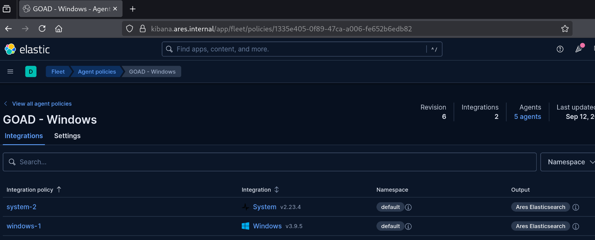
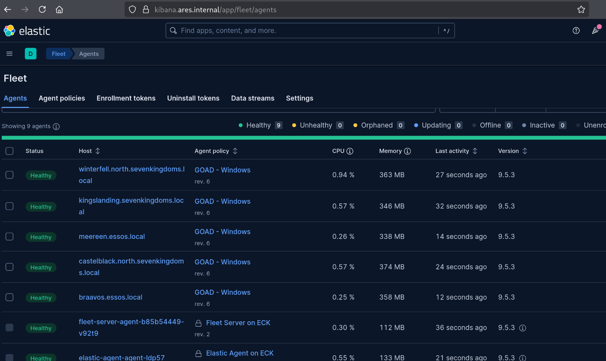
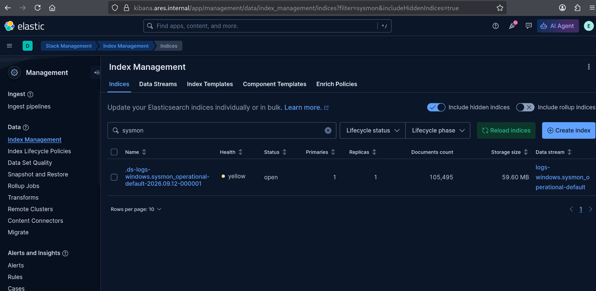

# Connecting GOAD

Now that I have the elastic stack up and running, I move to connect the GOAD environment to it.
This goes over how I install and connect the elastic agent, as well as Sysmon installation and configuration options.

## Ansible

Since GOAD is already instrumented through ansible by default, it surmised this would be the best, most efficient way of connecting and managing the actual telemetry aspect of this purple team lab.
To actually connect it, I simply need to add the existing GOAD inventory into my `inventory/hosts.ini` file. This then becomes something like the following:

```ini
[k3s_servers]
k3s-node-01 ansible_host=192.168.30.51 ansible_user=ubuntu
k3s-node-02 ansible_host=192.168.30.52 ansible_user=ubuntu
k3s-node-03 ansible_host=192.168.30.53 ansible_user=ubuntu

[goad_domain_controllers]
dc01 ansible_host=192.168.10.10
dc02 ansible_host=192.168.10.11
dc03 ansible_host=192.168.10.12

[goad_members]
srv02 ansible_host=192.168.10.22
srv03 ansible_host=192.168.10.23

[goad_windows:children]
goad_domain_controllers
goad_members
```

Also, we need to add the connection variables to our `inventory/group_vars/goad_windows.yml`:

```yaml
ansible_become: false

ansible_user: vagrant
ansible_password: vagrant

ansible_connection: winrm
ansible_port: 5985
ansible_winrm_transport: ntlm
ansible_winrm_server_cert_validation: ignore

ares_dns_zone: ares.internal
ares_dns_forwarder: 192.168.30.1
```
> note i just leverage the existing `vagrant` user used by GOAD

We can test connectivity using the following command:

```bash
ansible goad_windows -i inventory/hosts.ini -m ansible.windows.win_ping
```

which if successful outputs the following:

```text
srv03 | SUCCESS => {
    "changed": false,
    "ping": "pong"
}
srv02 | SUCCESS => {
    "changed": false,
    "ping": "pong"
}
dc02 | SUCCESS => {
    "changed": false,
    "ping": "pong"
}
dc03 | SUCCESS => {
    "changed": false,
    "ping": "pong"
}
dc01 | SUCCESS => {
    "changed": false,
    "ping": "pong"
}
```

## Elastic Agent

Now that we have basic connectivity, we can deploy the elastic agent and connect the endpoints to our elastic cluster.
To automate this, ive added another role called [elastic_agent](). Before we run it, we need to generate the policy manually in Fleet, and copy the enrollment token.

Navigate to the following panel in `kibana.ares.internal`:

```text
Fleet -> Agent Policies
```

and create a new policy. I called mine `GOAD - Windows`, and configured it as follows:



You can select whatever logs you want to collect in the individual integrations (`system-2`, `windows-1`).
Personally, for now, I turned off all perfmon / metrics, and enabled all windows logs in the windows integration, **most importantly the one for Sysmon**.

Now, you can click on:

```text
Actions -> Add agent
```

and copy out the enrollment token. This, you need to add into `roles/elastic_agent/defaults/main.yml`:

```yml
elastic_fleet_enrollment_token: <YOUR_TOKEN>
```

also be sure to adjust the other variables contained therein to whatever settings you may have changed (specifically, the FQDN fleet can be reached under).

Once these variables have been configured, you can enable your venv (should you not have done this already):

```bash
bash scripts/venv.sh
```

and apply the role:

```bash
ansible-playbook -i inventory/hosts.ini playbooks/goad-elastic.yml
```

Should this have worked correctly, you can now observe the GOAD endpoints appearing in fleet with the `GOAD - Windows` policy applied:



## Sysmon

In addition to the elastic agent for the collection of generated telemetry, I install and configure Sysmon to actually generate the required telemetry.

For now, to get things up and running, I use Olaf Hartongs [`sysmon-modular`](https://github.com/olafhartong/sysmon-modular) as a base.
By default I install the `default` configuration, to minimize data volume as I have limited space.
This will be adjusted on an as-needed basis using this ansible role, if im testing specific detections which may need more verbose and/or specialized telemetry.

Ive automated the rollout and configuration with a dedicated [ansible role](). This role also allows specification of different sysmon configurations by dropping it into `roles/sysmon/files/`, and adjusting the following variable in `roles/sysmon/defaults/main.yml`:

```yaml
sysmon_config_source: <YOUR_DESIRED_CONFIG>
```

We can apply this role as follows:

```bash
ansible-playbook -i inventory/hosts.ini playbooks/goad-sysmon.yml
```

If everything went well, we can see the following index gaining data in elastic:



---

