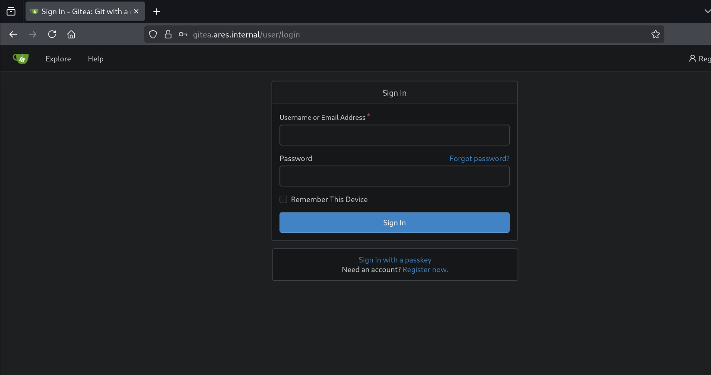
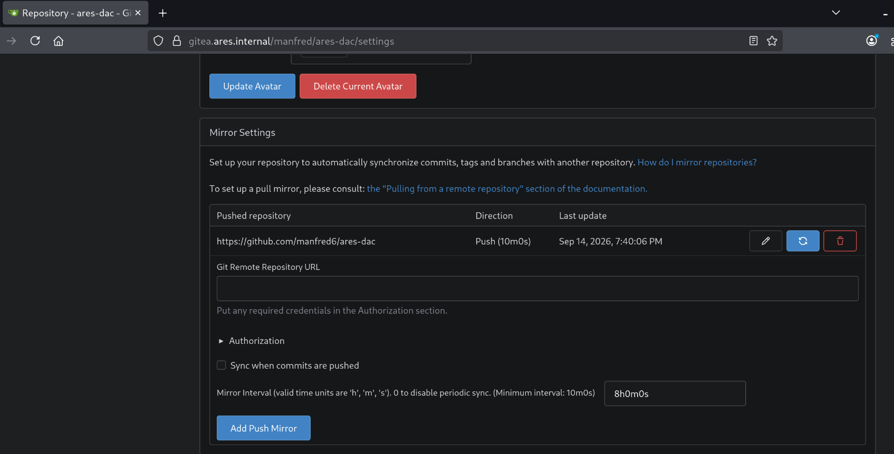

# Connecting Git

Now that we have elastic and GOAD set up, I want to create and connect a github repository containing all detections I write, as well as their respective CI/CD setup.
I want this to be wired up in a [`VCS-Authoritative`]() setup. This brings with it important security considerations.
The runners need a way to actually edit rules in Kibana, which requires access into my lab environment on both the network and identity planes.
Since the repo is public, this potentially opens up a path into my environment for anyone who can access and modify the repo, or anyone who can mess with github runners generally.
I dont really want to even open myself up to the risk, and id like to maintain control over all the infra Io can in case they decide to ever add pricing to self-hosted runners etc. I like the autonomy.
As such, ill deploy `Gitea` on my k3s cluster, and simply mirror the rules into a public github repo.

## Gitea

To deploy Gitea, I created a corresponding Ansible role [`gitea`](), which deploys Gitea on the k3s cluster with traefik ingress, and configures runners, also on k3s.
I disable postgres and valkey as its only myself using it in a lab setting, therefore keeping it lightweight is a priority.

First, the venv must be activated on the provisioning host:

```bash
bash scripts/venv.sh
```

The Gitea configuration is as usual present in `roles/gitea/defaults/main.yml`.
First, I set a password for the `Gitea Admin`:

```bash
PW="$(pwgen 64 1)"
echo "Gitea Admin: $PW"
export GITEA_ADMIN_PASSWORD=$PW
```

Now, we still have to wire up the provisioning host with the correct DNS configuration so it can provision Gitea:

```
cat << EOF > /etc/systemd/resolved.conf.d/10-ares-dns.conf
[Resolve]
DNS=192.168.30.1
Domains=ares.internal ~.
EOF
ln -sf /run/systemd/resolve/stub-resolv.conf /etc/resolv.conf
systemctl restart systemd-resolved && \
    nslookup gitea.ares.internal
```

If this outputs:

```text
Server:         127.0.0.53
Address:        127.0.0.53#53

Non-authoritative answer:
Name:   gitea.ares.internal
Address: 192.168.30.200
```

then we were successfu. Now, we can run the gitea playbook:

```bash
ansible-playbook -i inventory/hosts.ini playbooks/gitea.yml
```

Once this has completed, we can access Gitea under `https://gitea.ares.internal` with the user `gitea-admin` and the generated password:




I now add a dedicated user for myself to host the ares-dac repo under, as this user doesnt need administrative privileges on the gitea instance.

## Mirror

Now, I create the `ares-dac` repos in Gitea and Github, and configure the mirroring.

First, create the repo and generate a PAT in github (`Contents: Read Write`).
Once created, copy the PAT, create the repo in Gitea, and add the Github repo under `Mirror Settings as follows:



Now, were ready to set up the DaC plumbing.

---
