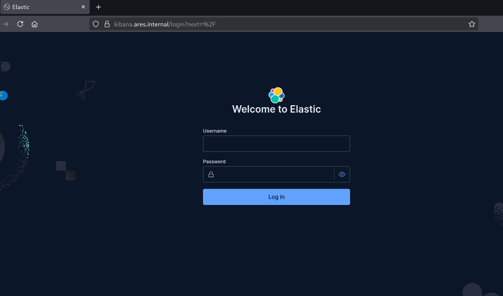

# Elastic Cloud on Kubernetes

This section details the configuration and deployment of the Elastic Cloud on Kubernetes (ECK) setup for my lab.

## Configuration

As mentioned previously, all deployments on my ECK cluster are managed through Ansible. 
This includes ECK, which is configued and deployed using my [`eck`](https://github.com/manfred6/ares-infra/tree/main/ansible/roles/eck) Ansible role.

Within [`tasks/main.yml`](https://github.com/manfred6/ares-infra/blob/main/ansible/roles/eck/tasks/main.yml), the Elasticsearch deployment is defined as follows:

```yaml
- name: Deploy single-node Elasticsearch
  kubernetes.core.k8s:
    kubeconfig: "{{ elastic_kubeconfig }}"
    state: present
    definition:
      apiVersion: elasticsearch.k8s.elastic.co/v1
      kind: Elasticsearch
      metadata:
        name: "{{ elasticsearch_name }}"
        namespace: "{{ elastic_namespace }}"
      spec:
        version: "{{ elastic_stack_version }}"
        monitoring:
          metrics:
            elasticsearchRefs:
              - name: "{{ elasticsearch_name }}"
          logs:
            elasticsearchRefs:
              - name: "{{ elasticsearch_name }}"
        nodeSets:
          - name: default
            count: 1
            podTemplate:
              spec:
                containers:
                  - name: elasticsearch
                    resources:
                      requests:
                        memory: "{{ elasticsearch_memory_request }}"
                        cpu: "{{ elasticsearch_cpu_request }}"
                      limits:
                        memory: "{{ elasticsearch_memory_limit }}"
                        cpu: "{{ elasticsearch_cpu_limit }}"
            volumeClaimTemplates:
              - metadata:
                  name: elasticsearch-data
                spec:
                  accessModes:
                    - ReadWriteOnce
                  storageClassName: "{{ elasticsearch_storage_class }}"
                  resources:
                    requests:
                      storage: "{{ elasticsearch_storage_size }}"
```

This is a single node deployment using the `local-path` storage provider. 
Since im using a single elasticsearch pod, it is not necessary to introcude affinity rules.
This would be a necessity if data availability and integrity were a priority.
If it is in your case, you need to scale up the resources available to the pods to at least three such that elasticsearch can reach quorum, and you reach the desired high availability setup.

```yaml
nodeSets.count: 3
```

Typically, youd also need to add anti-affinity and affinity rules to achieve the desired high-availability deployment.
This is not necessary in this case for a couple of reasons:

- First, since we are using the `local-path` provisioner, we want the pod to always land on the node where its data resides.
This is added by defauly by K3S. Its `local-path` provisioner creates each `PersistentVolume` with node affinity for the node on which its data resides.
As such, this is already our desired default.
- Second, should a worker node fail, we wouldnt want two elasticsearch pods to be on that very node. When using multiple Elasticsearch pods, they should be distributed across separate Kubernetes nodes so that the loss of one K3S node does not remove multiple Elasticsearch instances at once. ECK already accounts for this. ECK already applies a preferred pod anti-affinity rule by default, using `kubernetes.io/hostname` as the boundary. It also configures elasticsearch with kubernetes node allocation awareness, preventing a primary shard and its replica from being allocated to elasticsearch pods running on the same kubernetes node.
> note this only protects against pod, node and vm failure, NOT agains host or disk failure.


## Deployment

First, we must activate the venv. This can be done using [`this helper script`](https://github.com/manfred6/ares-infra/blob/main/ansible/scripts/venv.sh) as follows:

```bash
bash sripts/venv.sh
```

Now that the venv is activated, we can deploy our elasticsearch cluster.

All settings are defined in [`defaults/main.yml`](https://github.com/manfred6/ares-infra/blob/main/ansible/roles/eck/defaults/main.yml), and can be adjusted there.
Kibana and Fleet are defined and configured in the same fashion as the elasticsearch cluster.

This role can be deployed as such:

```bash
ansible-playbook -i inventory/hosts.ini playbooks/eck.yml
```

We can check the deployment status of the pods as follows:

```bash
export KUBECONFIG=/root/ares-detection/ansible/artifacts/kubeconfig.yaml
kubectl get pods -n elastic
```

This should produce somethine like the following:

```text
NAME                                 READY   STATUS    RESTARTS          AGE
elastic-agent-agent-fsnf5            1/1     Running   292 (2d12h ago)   3d12h
elastic-agent-agent-ldp57            1/1     Running   291 (2d12h ago)   3d12h
elastic-agent-agent-qj5lr            1/1     Running   290 (2d12h ago)   3d12h
elasticsearch-es-default-0           3/3     Running   0                 45h
fleet-server-agent-b85b54449-v92t9   1/1     Running   291 (2d12h ago)   3d12h
kibana-kb-598fb8ff6c-jbpt4           3/3     Running   0                 45h
```

The state of the operator can be checked as follows:

```bash
kubectl get pods -n elastic-system
```

which should output the following:

```text
NAME                 READY   STATUS    RESTARTS        AGE
elastic-operator-0   1/1     Running   2 (2d12h ago)   3d12h
```

Once connected to the wireguard tunnel, we can access kibana using the provisioned wildcard dns record:



> note we can import the CA certificate from `.secrets` into our browser to skip the TLS validation warning

---

