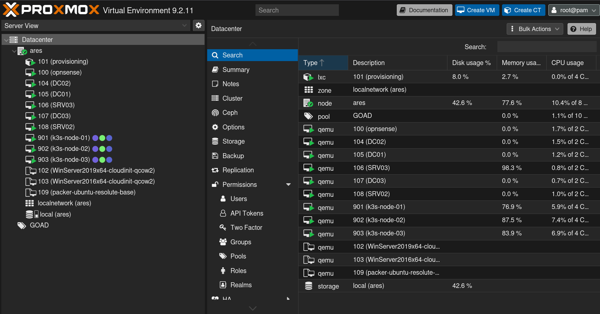

# Terraform

Picking up where we left off in the Packer section (read this if you havent already before continuing), we are now ready to deploy the virtual machines that encompass our future detection stack services.
To achieve this in a reproducable, auditable and scalable way, we leverage [`Hashi Corp Terraform`](https://developer.hashicorp.com/terraform). 
Terraform is an infrastructure as code (IaC) framework, which allows for the declarative management of infrastructure. In our current case, this will be the three virtual machines that will host the kubernetes services to be deployed in later steps.
The source code for this particular setup can be found in the dedicated [`ares-infra`](https://github.com/manfred6/ares-infra) repository, under the [`terraform`](https://github.com/manfred6/ares-infra/tree/main/terraform) directory.
Included there are also scripts, which automate the linting and deployment of the provided configuration.

## Terraform Providers

To apply terraform in this situation, as i am on Proxmox, I utilize the [`bpg/proxmox`](https://registry.terraform.io/providers/bpg/proxmox/latest) terraform provider:
Additionally, I dynamically generate TLS material for the provided servers (as the templates generated using packer contain only ephemeral key material) using the native [`hashicorp/tls`](https://registry.terraform.io/providers/hashicorp/tls/latest) provider. 
Randomized user-passwords are generated per node using [`hashicorp/random`](https://registry.terraform.io/providers/hashicorp/random/latest) provider.

```hcl
terraform {
  required_version = ">= 1.6"

  required_providers {
    proxmox = {
      source  = "bpg/proxmox"
      version = "~> 0.111"
    }
    random = {
      source  = "hashicorp/random"
      version = "3.9.0"
    }
    tls = {
      source  = "hashicorp/tls"
      version = "4.4.0"
    }
    local = {
      source = "hashicorp/local"
    }
  }
}
```

## Terraform Configuration

The terraform configuration is set up such that I can simply add nodes in the [`variables.tf`](https://github.com/manfred6/ares-infra/blob/main/terraform/variables.tf) file, and they get deployed in a predictable way into my proxmox environment. This can be done as such:

```hcl
variable "vm_k3s_node_definitions" {
  type = map(object({
    vm_name        = string
    vm_description = string
    vm_id          = number
    net_ip_cidr    = string
  })) 
  default = {
    "k3s-node-01" = {
      vm_name        = "k3s-node-01",
      vm_description = "K3S Combined Node 01",
      vm_id          = 901,
      net_ip_cidr    = "192.168.30.51/24"
    },
    "k3s-node-02" = {
      vm_name        = "k3s-node-02",
      vm_description = "K3S Combined Node 02",
      vm_id          = 902,
      net_ip_cidr    = "192.168.30.52/24"
    },
    "k3s-node-03" = {
      vm_name        = "k3s-node-03",
      vm_description = "K3S Combined Node 03",
      vm_id          = 903,
      net_ip_cidr    = "192.168.30.53/24"
    }
  }
}
```

Other settings such as cpu assignments, disk size, memory size, etc are defined cluster wide (also in [`variables.tf`](https://github.com/manfred6/ares-infra/blob/main/terraform/variables.tf)). This can me migrated to a per-node configuration later on, but i dont see it as necessary for now.


## Creating the Cluster

I have provided a helper-script in [`scripts/init.sh`](https://github.com/manfred6/ares-infra/blob/main/terraform/scripts/init.sh) to help instantiate the cluster:

```bash
#!/bin/bash

set -euo pipefail

terraform init
terraform validate .
terraform plan -var-file="variables.tfvars" -out "plan.tfplan"
terraform apply "plan.tfplan"
```

This initiates the terraform providers, validates the config, plans the deployment, and deploys it.
Note that the key material gets placed in a `.secrets` directory, which is included in `.gitignore`.

Terraform also writes the ansible [`hosts.ini`](https://github.com/manfred6/ares-infra/blob/main/ansible/inventory/hosts.example.ini), which is configured in [`outputs.tf`](https://github.com/manfred6/ares-infra/blob/main/terraform/outputs.tf):

```hcl
# Ansible inventory (INI format)
resource "local_file" "ansible_inventory" {
  filename = "${path.module}/../ansible/inventory/hosts.ini"

  content = <<-EOT
[k3s_servers]
%{ for name, srv in var.vm_k3s_node_definitions ~}
${name} ansible_host=${proxmox_virtual_environment_vm.ubuntu_vm[name].ipv4_addresses[1][0]} ansible_user=${var.os_username}
%{ endfor ~}
EOT

  file_permission = "0644"
}
```

This same file also generates a corresponding [`ansible.cfg`](https://github.com/manfred6/ares-infra/blob/main/ansible/ansible.cfg), including settings for where ansible can find the private key generated by terraform:

```hcl
resource "local_file" "ansible_config" {
  filename = "${path.module}/../ansible/ansible.cfg"

  content = <<-EOT
[defaults]
inventory = ${abspath("${path.module}/../ansible/inventory/hosts.ini")}
roles_path = ${abspath("${path.module}/../ansible/roles")}
private_key_file = ${abspath(local_sensitive_file.k3s_private_key.filename)}
host_key_checking = False
interpreter_python = auto_silent
retry_files_enabled = False

[ssh_connection]
pipelining = True
EOT

  file_permission = "0644"
}
```

So, once we apply our stuff using:

```bash
bash scripts/init.sh
```

and everything goes well, we should be set and see three new virtual machines:


